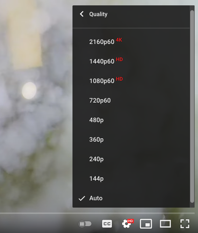
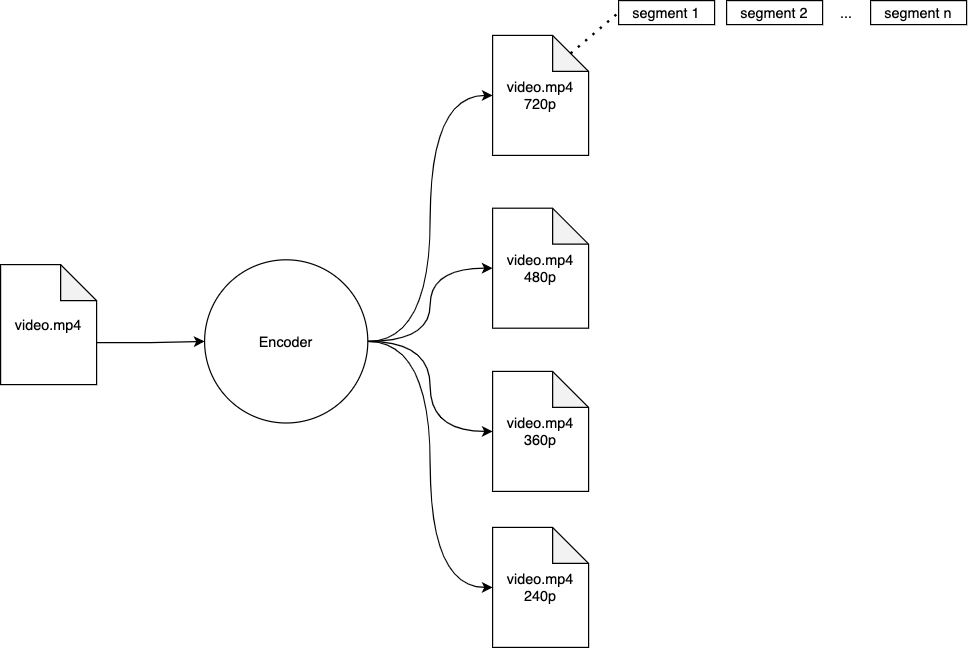
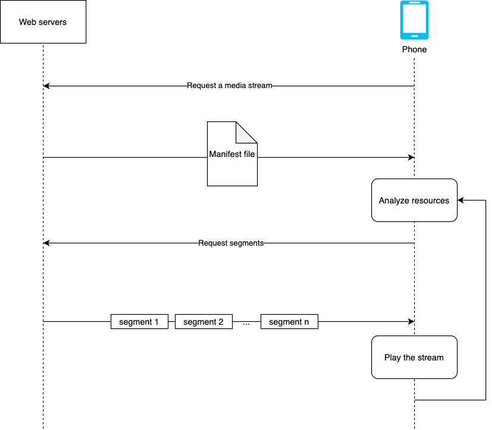

What is adaptive bitrate streaming? How does it work? And what benefits does it offer?

<!-- truncate -->

If you watch a video on the Internet right now, chances are it's being delivered to you by a technique called *adaptive bitrate streaming*. Adaptive bitrate streaming helps you experience uninterrupted playback, even on an old/low-performance device, or on a cellular network. No longer staring at the spinning screen. No longer having to download the video to watch offline. It's just smooth!

Over the past few weeks, I've been working on a project that requires some understanding of this technique. And here are some of my findings. Let's get into it!

## What is adaptive bitrate streaming?

Adaptive bitrate streaming is a technique used in streaming multimedia. It works by detecting a user's available resources, especially network bandwidth, to adjust the quality of the stream in real-time so that the user experience as smooth playback as possible.

The easiest example is watching a YouTube video. Have you ever noticed when you start watching a video, the quality is usually 480p, and after a few seconds it switches to 720p or 1080p, then if you go too far from your wifi router, it switches back to 480p so you can keep watching without being interrupted? That's adaptive bitrate streaming I'm talking about.

## How does it work?

For this little magic to work out, we need some processing at both the server and the client.

When a media file is uploaded, it is encoded into multiple versions of itself at different bit rates (for videos, usually at different resolutions too). These versions then get chunked into small segments. The size of these segments depends on the implementations but is typically between 2 and 10 seconds.

When a user plays a video, the player client requests the server and receives a manifest file, which tells the player client how many segments this video has and where to find them. The segments are served over HTTP.

Now the player client runs an algorithm to analyze the device resource metrics, including network speed, network bandwidth, and CPU capacity. It then chooses the segments with the suitable quality to start playing, while continues to run the algorithm in real-time and makes changes adaptively to the available resources.

The result is we have a very self-aware guy who can analyze stuff and pick the right work to do, all to give us — the end-users — the best experience possible.

## Pros and cons

Compared to traditional multimedia streaming, back when the user has to download the media stream in the original quality and struggles when network speed is limited, adaptive bitrate streaming brings a lot of advantages, both for users and developers:

- Smooth playback in various network conditions.
- Serving over HTTP, widely compatible and secured.
- Can make use of our CDNs to cache media segments. This is a huge deal.
- Less development cost to develop and maintain servers that use other streaming protocols like [RTSP](https://en.wikipedia.org/wiki/Real_Time_Streaming_Protocol).

The seemingly only con when using adaptive bitrate streaming is more storage cost, as we have to store multiple copies of a media file source. However, with all the good stuff we're getting from it, adaptive bitrate streaming is a great technique that benefits everyone.

## What's more?

There are numerous well-known implementations like [MPEG-DASH](https://en.wikipedia.org/wiki/Dynamic_Adaptive_Streaming_over_HTTP) or [HLS](https://en.wikipedia.org/wiki/HTTP_Live_Streaming), which you can read more about. There is [this](https://youtube-eng.googleblog.com/2018/04/making-high-quality-video-efficient.html) blog post by YouTube on how they're doing adaptive video streaming. You can also take a look at [RTP](https://en.wikipedia.org/wiki/Real-time_Transport_Protocol), which is a protocol that's used in multimedia streaming. Have fun reading!
